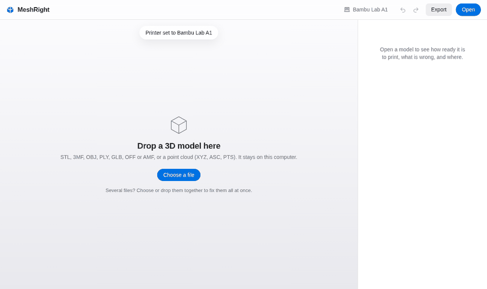

# MeshRight

**Check and fix 3D scans and models for printing. Free, simple, and on your own computer.**

MeshRight is a free, open source alternative to Meshmixer's repair tools
(Meshmixer is no longer developed). It is made for people who 3D print scans
and downloaded models and want one simple tool instead of several. It runs on
Windows, macOS and Linux, and opens in your web browser, but everything
happens on your own computer.



> **Status: early alpha.** Everything below works; expect rough edges.
> Please report problems with an example file.

## In three steps

1. **Open** a scan or model. MeshRight checks it and gives it a score from 0
   to 100, with every problem explained in plain English and shown on the model.
2. **Follow the checklist**: Fix problems → Stand it up → Fits your printer →
   Export. Each step is one button, and every change can be undone.
3. **Print**: export a file, or open it straight in your slicer.

No settings to learn, no account, and your files never leave your computer.

## What it can do

**Check**
- Opens STL, 3MF, OBJ, PLY, GLB/glTF, OFF and AMF, and turns point clouds
  (XYZ, ASC, PTS) into a surface. Wrong units and phone-scan orientation
  (metres, Y up) are fixed automatically.
- A print-readiness score and a plain-English list of problems: holes, edges
  shared by too many triangles, surfaces cutting through themselves,
  inside-out parts, loose crumbs, walls too thin to print.
- Problems are shown on the model, plus a **Cut view**, an **Overhangs** view
  and a **Rough spots** view.

**Fix**
- **Clean up** in one click. It shows its plan first; choose Quick print,
  Balanced, Keep all detail or Flexible (for TPU, which then gets a stricter
  wall check).
- **Make Solid** rebuilds badly broken models as one closed solid.
- **Give it thickness** turns an open surface (a face scan, a mask) into a
  printable shell.
- **Sculpt** brushes: smooth rough spots, flatten, push out or in.

**Stand it up**
- **Which way is up?** offers pictures of likely bottoms; or click the bottom
  yourself.
- **Best way to print** compares placements for fewest supports, strongest
  part and fastest print.
- Warns when a model would tip over, and offers to cut the bottom flat or
  add a flat foot (which keeps the whole model).

**Fit your printer**
- Pick your printer once from a list, or enter its bed size.
- Too big? The checklist offers both: **shrink** it to fit, or **split** it
  into parts that fit, with pins so they line up when glued. **Cut in two**
  anywhere with a plane you slide.
- **Numbered parts**: each part's number is engraved on a cut face (hidden
  once glued), in assembly order, and MeshRight tells you which parts join.
- Show a **coin for scale** beside the model to picture its real size.

**Edit**
- Erase an area or a loose piece, drill holes, measure (and resize from a
  known distance), hollow for resin with drain holes.
- **Make a bust** from a head scan: closes the neck, cuts it flat, adds a base.
- **Make a part** that fits your scan (a pad, a grip, a cover).
- **Combine models**: join a stand or handle on, or cut a shape out.
- **Merge scans** taken from different sides into one model.

**Colours and export**
- Keeps colours from colour scans through every repair.
- Export STL, 3MF, OBJ or PLY, or **open it straight in** Bambu Studio,
  OrcaSlicer, PrusaSlicer, UltiMaker Cura or Creality Print.
- Save a project (.meshright) to carry on later.

**And**
- Several models open at once, in tabs. Very big files can be cancelled
  while they open.
- Fix many files at once, in the app or from the command line.
- Sample models, first-time tips and keyboard shortcuts (press **?**).
- Runs on your own computer and works offline. The only thing it asks the
  internet is GitHub's latest version number, once a day (you can switch
  that off).

## Install

**Easiest:** download the app for your computer from the
[Releases page](https://github.com/Huzy85/MeshRight/releases):
`MeshRight-windows.exe`, `MeshRight-macos` or `MeshRight-linux`.
Double-click it and MeshRight opens in your web browser. Nothing else to
install.

> The apps are not signed yet. On Windows choose *More info → Run anyway*. On a
> Mac, right-click the file and choose *Open* the first time. On Linux, allow
> the file to run as a program (right-click → Properties → Permissions).

**With Python** (3.10 or newer), install it from this repository:

```bash
git clone https://github.com/Huzy85/MeshRight.git
cd MeshRight
pip install .
```


## Use

Open the app in your browser:

```bash
meshright
```

Check files from the command line:

```bash
meshright check model.stl other_model.3mf
meshright check model.stl --json
```

`meshright check` exits with code 1 when any file needs repair, so it can be
used in scripts.

Fix a whole folder (the fixed files and a report go into `meshright-fixed`):

```bash
meshright fix scans/
meshright fix scans/ --format stl --best-bottom
```

## Contributing

Contributions are welcome, from bug reports with example files to new repair
tools. See [CONTRIBUTING.md](CONTRIBUTING.md).

## Licence

MeshRight is free software under the [GNU GPL v3](LICENSE). The bundled
[three.js](https://threejs.org) library is MIT licensed.
